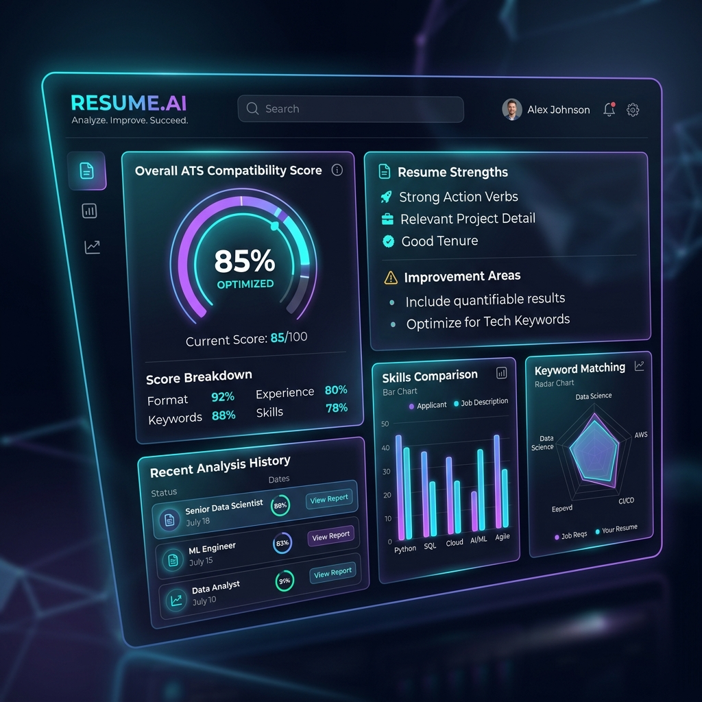
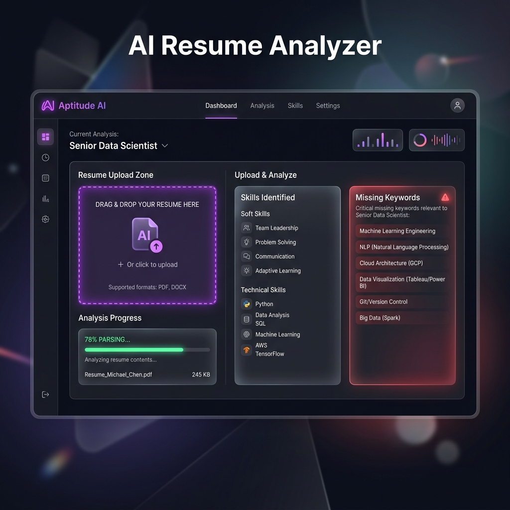
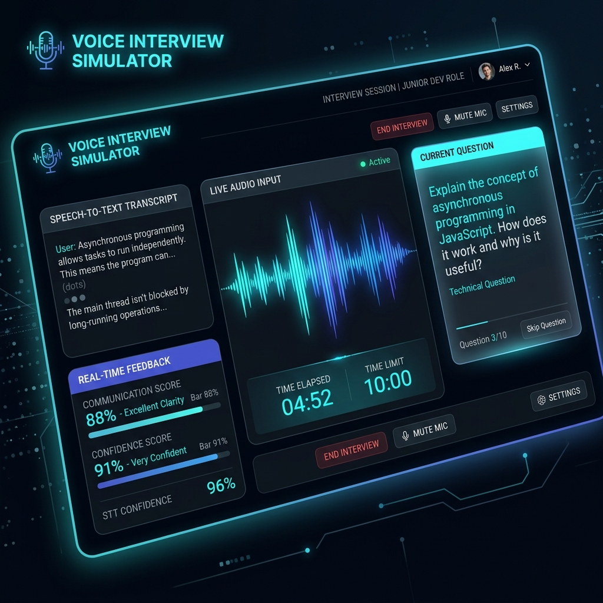

# 🤖 AI Resume Analyzer & Career Intelligence Platform

Welcome to the **AI Resume Analyzer & Career Intelligence Platform**! This is a visually stunning, futuristic, and fully featured career assistant application. It helps candidates analyze their resumes, generate detailed ATS (Applicant Tracking System) scores, get custom learning roadmaps, and practice mock interviews using voice.

---

## 📸 Frontend Screenshots

Here is a preview of the platform's visual design and features:

### 📊 1. Main Dashboard
A sleek glassmorphism dashboard displaying overall stats, resume history, and career progress metrics.


### 🔍 2. Resume Analyzer & ATS Diagnostic
Upload resumes to parse structured profiles and review ATS scores, missing keywords, and structural weaknesses.


### 🎙️ 3. AI Mock Interview Voice Simulator
Practice live verbal interviews with real-time waveform visualization, speech-to-text feedback, and performance scoring.


---

## ⚙️ How It Works (Simple Explanation)

Here is a simple explanation of what happens behind the scenes:

1. **Upload & File Parsing**: When you upload a resume (`.pdf`, `.docx`, or `.txt`), the backend's **Parser Service** reads and extracts the raw text.
2. **AI Structuring (JSON)**: The raw text is passed to **Google Gemini AI** (`gemini-1.5-flash`), which converts the messy text into a clean, structured JSON model (extracting your name, contact, work history, education, and skills).
3. **ATS Assessment**: The system compares your resume details against the Job Description. The AI calculates an overall ATS score and highlights:
   - **Missing Keywords** that recruiters look for.
   - **Weaknesses** in your phrasing.
   - **Suggestions** to write better resume bullets using the STAR method.
4. **Voice Evaluation**: In the Voice Simulator, the AI generates custom questions. When you speak, the application records your voice, converts it to text, and evaluates:
   - **Technical accuracy** of your answer.
   - **Confidence level** and **Fluency**.
   - It also provides a **Sample Answer** showing you the perfect way to answer.
5. **Database Storage**: All user accounts, resume versions, chat conversations, mock sessions, and feedback history are stored securely in a local database (**SQLite** by default).

---

## 🚀 Setup & Running Locally

Follow these simple steps to run this project on your system:

### 📋 Prerequisites
Make sure you have [Node.js](https://nodejs.org/) installed (version 18 or higher is recommended).

---

### 📥 Step-by-Step Installation

#### 1. Open the project folder
Open your terminal (Command Prompt, PowerShell, or Bash) and make sure you are in the root directory:
```bash
# Verify you are in the Ai-Resume-Analyzer directory
```

#### 2. Run the Backend Server 🖥️
The backend handles database queries, parsing, and AI responses.
1. Navigate to the `backend` folder:
   ```bash
   cd backend
   ```
2. The packages are already installed, but you can double-check by running:
   ```bash
   npm install
   ```
3. Create/verify the `.env` file configuration in the `backend` folder:
   ```env
   PORT=5000
   JWT_SECRET=super_secret_resume_key_12345
   JWT_REFRESH_SECRET=super_secret_refresh_key_12345
   USE_SQLITE=true
   GEMINI_API_KEY=your_gemini_api_key_here
   ```
   *(Note: If you do not have a Gemini API key, leave the key empty. The system will automatically switch to **Mock mode** and generate realistic test data so you can still use every feature!)*
4. Start the backend developer server:
   ```bash
   npm run dev
   ```
   *The backend will start running on [http://localhost:5000](http://localhost:5000).*

---

#### 3. Run the Frontend Server 🎨
The frontend is the graphical interface where you interact with the app.
1. Open a **new, separate terminal** window.
2. Navigate to the `frontend` folder:
   ```bash
   cd frontend
   ```
3. Install the dependencies (if you haven't already):
   ```bash
   npm install
   ```
4. Start the Angular dev server:
   ```bash
   npm start
   ```
5. Open your web browser and go to:
   ```text
   http://localhost:4200
   ```

You are ready! Register a new account on the login page and start analyzing your resumes.

---

## 📂 Project Structure

```text
Ai-Resume-Analyzer/
├── backend/
│   ├── src/
│   │   ├── config/          # db.js (SQLite database adapter)
│   │   ├── controllers/     # Controller logic (Auth, Resume, ATS, Career Coach, Voice, Chatbot)
│   │   ├── middlewares/     # Authentication & File upload interceptors
│   │   ├── routes/          # API endpoint routes mapping
│   │   ├── services/        # ai.service (Gemini wrapper) & parser.service (file parsing)
│   │   └── app.js, server.js
│   ├── uploads/             # Temp directory for uploaded resumes
│   └── resume_analyzer.db   # SQLite local database file
│
├── frontend/
│   ├── src/
│   │   ├── app/
│   │   │   ├── core/        # Route guards, authentication services
│   │   │   ├── features/    # UI Pages (Dashboard, Analyzer, Builder, Voice, Mentor, Coach, etc.)
│   │   │   └── shared/      # Global Layout framework
│   │   └── styles.css       # Core design styles, colors and glow animations
│
└── screenshots/             # Mockup screens referenced in README
```

---

## 🔗 Main API Endpoints

* **Auth**: `POST /api/auth/register` | `POST /api/auth/login`
* **Resumes**: `POST /api/resumes/upload` (Upload and parse) | `GET /api/resumes` (List resumes) | `PUT /api/resumes/:id` (Update/Save builder version)
* **ATS Analyzer**: `POST /api/ats/evaluate` (Audit score report)
* **Career Coach**: `GET /api/coach/roadmap` (Custom learning timelines)
* **Voice Simulator**: `POST /api/voice/session` (Generate questions) | `POST /api/voice/evaluate` (Evaluate spoken answer transcript)
* **Mentor Chat**: `POST /api/chat/query` (Send chat questions with profile context)

## 👨‍💻 Author

**Aaftab Pathan**

* GitHub: https://github.com/AaftabPathan
* LinkedIn: https://linkedin.com/in/aaftabpathan
* Gmail: aaftabaayubpathan@gmail.com

---

## ⭐ Support 

If you like this project, give it a ⭐ on GitHub!
